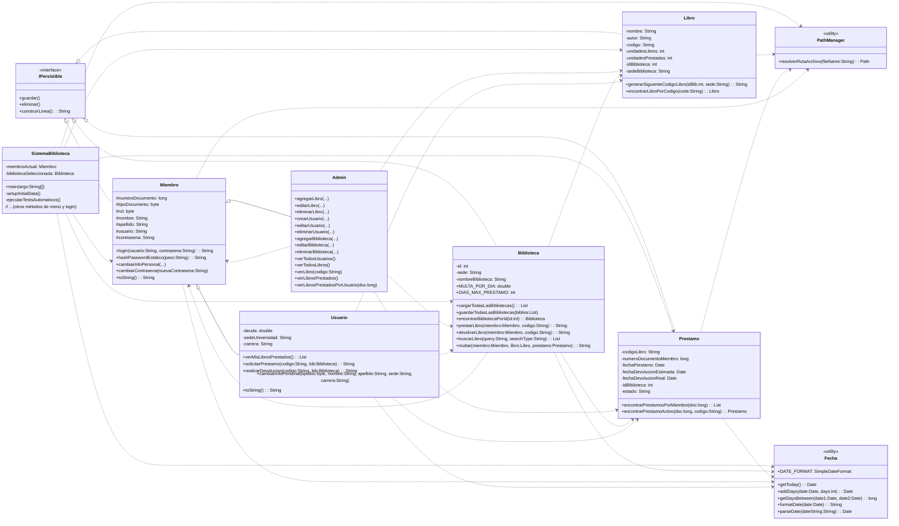

¡Hola, equipo! ¡Bienvenidos al fascinante mundo del desarrollo de software! Soy vuestro compañero y hoy seré vuestro guía para explorar este **Sistema de Gestión de Biblioteca**. Este `README.md` está diseñado para ser una inmersión profunda en el código, explicando no solo qué hace cada parte, sino también por qué y cómo funciona a nivel interno. La idea es que al final de esta sesión, tengáis una comprensión sólida de la arquitectura, la lógica de negocio y las decisiones de diseño tomadas.

Vamos a hacer esto robusto. ¡Comencemos!

---

# Sistema de Gestión de Biblioteca

Este proyecto implementa un sistema de gestión integral para una biblioteca universitaria, diseñado para ser intuitivo y funcional tanto para administradores como para usuarios regulares. Permite la administración de la colección de libros, la gestión de usuarios con diferentes roles, y el control preciso de los procesos de préstamo, devolución y multas.

## 1. Visión General del Sistema

El sistema nace de la necesidad de digitalizar y optimizar la gestión de recursos en una o varias bibliotecas. Su propósito es facilitar el acceso a la colección de libros, regular los préstamos y devoluciones, y mantener un registro exhaustivo de la interacción de los miembros con la biblioteca.

**Audiencia Objetivo:**

- **Administradores:** Personal de la biblioteca encargado de la gestión del inventario, los registros de usuarios y la configuración general del sistema.
- **Usuarios:** Estudiantes, profesores y personal administrativo de la universidad que desean acceder a los recursos bibliográficos.

**Funcionalidades Clave:**

- **Gestión de Catálogo:** Administración completa de libros y sus unidades.
- **Gestión de Miembros:** Creación, edición y eliminación de perfiles de administradores y usuarios.
- **Gestión de Préstamos:** Proceso de préstamo y devolución de libros, incluyendo reglas de negocio y cálculo de multas.
- **Persistencia de Datos:** Todos los datos se almacenan en archivos de texto plano para garantizar su disponibilidad entre sesiones.
- **Autenticación Segura:** Los miembros se autentican utilizando contraseñas hasheadas de forma segura.
- **Configuración Dinámica:** Posibilidad de gestionar múltiples bibliotecas y sus sedes.

## 2. Arquitectura y Diseño de Clases

La arquitectura del sistema está diseñada para ser modular y escalable, haciendo uso de principios de Programación Orientada a Objetos como la herencia, el polimorfismo y la encapsulación. La persistencia de datos está desacoplada de la lógica de negocio a través de una interfaz, lo que permite un mantenimiento más sencillo.

### 2.1. Estructura de Paquetes

Todo el código fuente reside en el paquete `com.mycompany.sistemabiblioteca`. Esta estructura facilita la organización y el manejo de los diferentes componentes del sistema.

```
src/
└── com/
    └── mycompany/
        └── sistemabiblioteca/
            ├── Admin.java
            ├── Biblioteca.java
            ├── Fecha.java
            ├── IPersistible.java
            ├── Libro.java
            ├── Miembro.java
            ├── PathManager.java
            ├── Prestamo.java
            ├── SistemaBiblioteca.java
            └── Usuario.java
```

### 2.2. Diagrama de Clases Conceptual

Para entender mejor las relaciones, podemos visualizar las clases principales:



### 2.3. Herencia

El sistema utiliza la herencia para modelar la relación entre los diferentes tipos de miembros del sistema:

- **`Miembro` (Clase Base Abstracta Conceptualmente):**

  - Actúa como la clase base para todos los individuos que interactúan con el sistema. Define los atributos y comportamientos comunes como el número de documento, tipo de documento, rol, nombre, apellido, usuario y la **contraseña hasheada**.
  - Implementa la lógica de autenticación (`login`, `hashPassword`, `verificarContrasena`) y la gestión de la información personal básica.
  - Contiene métodos de persistencia (`guardar()`, `eliminar()`, `construirLinea()`) que son comunes para todos los tipos de miembros.

- **`Admin` (Extiende `Miembro`):**

  - Representa al usuario con privilegios administrativos. Hereda todas las propiedades y métodos de `Miembro`.
  - Su rol se fija a `0` (Admin) en sus constructores, lo que asegura que una instancia de `Admin` siempre tenga el rol correcto.
  - Añade una amplia gama de métodos específicos para la **administración del sistema**: gestión de libros (agregar, editar, eliminar unidades), gestión de usuarios (crear, editar, eliminar, incluyendo validaciones complejas) y gestión de bibliotecas.
  - Sobrescribe el método `toString()` para ofrecer una representación textual clara de un administrador.

- **`Usuario` (Extiende `Miembro`):**
  - Representa a los usuarios regulares de la biblioteca (estudiantes, profesores, administrativos de la universidad).
  - Hereda de `Miembro` y añade atributos específicos a un usuario de biblioteca: `deuda` (si tiene multas pendientes), `sedeUniversidad` y `carrera`.
  - Sus constructores validan que un `Usuario` no pueda tener el rol `0` (Admin), asignando `1` (Estudiante) por defecto si se intenta.
  - Implementa métodos relacionados con las **interacciones del usuario**: ver sus préstamos, solicitar préstamos, realizar devoluciones y pagar deudas.
  - Sobrescribe `construirLinea()` para incluir sus atributos adicionales (`deuda`, `sedeUniversidad`, `carrera`) en la línea de persistencia.
  - Sobrecarga `cambiarInfoPersonal()` para permitir la actualización de sus atributos específicos además de los heredados.
  - Sobrescribe `toString()` para mostrar los detalles del usuario, incluyendo su deuda y su rol textual.

La herencia permite reutilizar código, mantener una estructura jerárquica clara y aplicar polimorfismo, donde métodos que esperan un `Miembro` pueden operar con objetos `Admin` o `Usuario` indistintamente para tareas comunes como el `login` o la persistencia.

### 2.4. Interfaces

El sistema define una interfaz clave para estandarizar el comportamiento de persistencia:

- **`IPersistible` (Interfaz):**
  - Define un contrato para cualquier objeto que deba ser guardado o eliminado en el almacenamiento persistente.
  - Especifica tres métodos:
    - `void guardar()`: Encargado de almacenar o actualizar el estado del objeto en su archivo correspondiente.
    - `void eliminar()`: Responsable de remover el registro del objeto del almacenamiento.
    - `String construirLinea()`: Devuelve una representación del objeto como una cadena de texto formateada para su almacenamiento en el archivo (delimitada por `\`).
  - **Utilidad:** Al implementar `IPersistible`, clases como `Miembro`, `Libro`, `Prestamo` y `Biblioteca` garantizan que comparten una forma común de ser gestionadas en términos de persistencia. Esto permite un diseño más limpio y facilita el manejo polimórfico de objetos cuando se trata de operaciones de entrada/salida de datos, aunque la implementación concreta de `guardar()` y `eliminar()` varía ligeramente entre clases para adaptarse a sus identificadores únicos y la lógica de actualización.

## 3. Descripción Detallada de Componentes

Ahora, profundicemos en cada clase, sus atributos, métodos y la lógica interna que los impulsa.

### `Admin`

- **Propósito:** Encapsula las responsabilidades y funcionalidades exclusivas de un administrador del sistema. Es el punto de entrada para todas las operaciones de gestión.
- **Atributos:** Hereda todos los atributos de `Miembro`. Su atributo `rol` se establece internamente a `0` (Admin) para garantizar la consistencia.
- **Constructores:**
  - `public Admin()`: Constructor por defecto que llama al constructor de la superclase y establece el `rol` a `0`.
  - `public Admin(byte tipoDocumento, long numeroDocumento, byte rol, String nombre, String apellido, String usuario, String contrasena)`: Constructor completo que llama al constructor de la superclase `Miembro`, pero fuerza el `rol` a `0` para asegurar que un objeto `Admin` siempre tenga este rol.
- **Métodos Principales (Lógica Detallada):**
  - `public String agregarLibro(String nombre, String autor, String codigoPropuesto, int unidadesTotales, int idBiblioteca, String sedeBiblioteca)`:
    - **Lógica:** Gestiona la adición de nuevos libros. Si `codigoPropuesto` es "auto" o nulo/vacío, delega a `Libro.generarSiguienteCodigoLibro()` para crear un código único basado en la biblioteca. Si se propone un código, verifica si ya existe. Crea una nueva instancia de `Libro` y llama a su método `guardar()`.
    - **Retorno:** Mensaje de éxito con el código del libro, o mensaje de error.
  - `public String editarLibro(String codigoLibro, String nuevoNombre, String nuevoAutor, int nuevasUnidadesTotales, int nuevaIdBiblioteca, String nuevaSedeBiblioteca)`:
    - **Lógica:** Busca el `Libro` por `codigoLibro`. Valida que las `nuevasUnidadesTotales` no sean menores que las `unidadesPrestadas` actuales para evitar inconsistencias. Actualiza los atributos del libro y recalcula `unidadesLibres`. Invoca `libro.guardar()`.
    - **Retorno:** Mensaje de éxito o error.
  - `public String eliminarLibro(String codigoLibro, int unidadesAeliminar)` (y sobrecarga `eliminarLibro(String codigoLibro)`):
    - **Lógica:** Localiza el `Libro`. Valida `unidadesAeliminar`. Permite eliminar solo `unidadesLibres`. Si se intenta eliminar más de las `unidadesLibres`, se ajusta la cantidad. Si después de la eliminación, tanto `unidadesLibres` como `unidadesPrestadas` llegan a `0`, se llama a `libro.eliminar()` para borrar el registro completo. De lo contrario, solo se actualizan las unidades y se `guarda()` el libro. La sobrecarga elimina todas las unidades libres por defecto.
    - **Retorno:** Mensaje detallado del éxito o de las restricciones.
  - `public String crearUsuario(byte tipoDocumento, long numeroDocumento, byte rol, String nombre, String apellido, String usuario, String contrasena, double deuda, String sedeUniversidad, String carrera)`:
    - **Lógica:** Valida que el `usuario` y `numeroDocumento` propuestos no existan ya en el sistema. Crea una nueva instancia de `Usuario` (que internamente se asegura de no tener rol Admin) y llama a `usuario.guardar()`.
    - **Retorno:** Mensaje de éxito o error.
  - `public String editarUsuario(String usuarioExistente, byte nuevoTipoDocumento, long nuevoNumeroDocumento, byte nuevoRol, String nuevoNombre, String nuevoApellido, String nuevoUsuario, String nuevaContrasena, double nuevaDeuda, String nuevaSedeUniversidad, String nuevaCarrera)`:
    - **Lógica:** Busca el `Miembro` base por `usuarioExistente`. Realiza validaciones para `nuevoUsuario` y `nuevoNumeroDocumento` para evitar duplicados. Actualiza los campos comunes de `Miembro`. Si el `nuevoRol` no es `0` (Admin), el objeto `Miembro` se trata como `Usuario` y se actualizan sus campos específicos. **Un punto crítico aquí es el manejo del cambio de rol de Admin a Usuario:** si un `Admin` cambia su rol a uno de `Usuario`, el sistema _crea una nueva instancia de `Usuario`_ con los datos, y _elimina el registro del antiguo `Admin`_. Esto es una simplificación; en un sistema real, un cambio de tipo de objeto persistido sería más complejo (por ejemplo, actualizando el mismo registro en lugar de eliminar y crear).
    - **Retorno:** Mensaje de éxito o error.
  - `public String eliminarUsuario(String usuarioAEliminar)`:
    - **Lógica:** Busca el `Miembro`. **Restricciones:** No permite eliminar a un `Admin`. Valida que el `Usuario` no tenga `Prestamo`s activos ni `deuda` pendiente. Si cumple las condiciones, marca el objeto para eliminación (`setUsuario(null)`) y llama a `guardar()`, que internamente lo elimina del archivo.
    - **Retorno:** Mensaje de éxito o de las restricciones.
  - `public String agregarBiblioteca(int id, String sede, String nombreBiblioteca)`:
    - **Lógica:** Valida que el `id` y `sede` no existan ya. Crea una nueva `Biblioteca` y la añade a la lista global cargada (`Biblioteca.cargarTodasLasBibliotecas()`), luego `guardarTodasLasBibliotecas()` para persistir toda la lista.
    - **Retorno:** Mensaje de éxito o error.
  - `public String editarBiblioteca(int id, String nuevaSede, String nuevoNombre)`:
    - **Lógica:** Carga todas las bibliotecas, busca la que coincida con el `id`, actualiza sus atributos y vuelve a guardar toda la lista (`Biblioteca.guardarTodasLasBibliotecas()`).
    - **Retorno:** Mensaje de éxito o error.
  - `public String eliminarBiblioteca(int id)`:
    - **Lógica:** Carga todas las bibliotecas, usa `removeIf` para eliminar la biblioteca con el `id` dado y vuelve a guardar la lista.
    - **Retorno:** Mensaje de éxito o error.
  - `public void verTodosUsuarios()`, `public void verTodosLibros()`, `public void verLibro(String codigoLibro)`, `public void verLibrosPrestados()`, `public void verLibrosPrestadosPorUsuario(long numeroDocumentoMiembro)`:
    - **Lógica:** Métodos de visualización que cargan datos relevantes (`Miembro.cargarTodosLosMiembros()`, `Libro.cargarTodosLosLibros()`, `Prestamo.cargarTodosLosPrestamos()`) y los imprimen por consola, a menudo con filtros (ej. préstamos activos, préstamos de un miembro específico). `verLibro` incluye los préstamos asociados a ese libro.

### `Biblioteca`

- **Propósito:** Representa una sede física de la biblioteca. Contiene la lógica central para los procesos de préstamo, devolución y multas, así como constantes importantes.
- **Atributos:** `id`, `sede`, `nombreBiblioteca`. Además, constantes estáticas: `MULTA_POR_DIA` y `DIAS_MAX_PRESTAMO`.
- **Constructores:**
  - `public Biblioteca(int id, String sede, String nombreBiblioteca)`: Constructor completo.
  - `public Biblioteca()`: Constructor por defecto.
- **Métodos Principales (Lógica Detallada):**
  - `protected static Path resolverRutaBibliotecas()`: Helper para obtener la ruta del archivo de persistencia de bibliotecas.
  - `public static List<Biblioteca> cargarTodasLasBibliotecas()`:
    - **Lógica:** Lee `Bibliotecas.txt` línea por línea. Cada línea se divide por `\` y se parsea para reconstruir objetos `Biblioteca`. Si el archivo no existe, devuelve una lista vacía. Incluye manejo de `NumberFormatException` y `IOException`.
    - **Retorno:** Una `List` de objetos `Biblioteca`.
  - `public static synchronized void guardarTodasLasBibliotecas(List<Biblioteca> bibliotecas)`:
    - **Lógica:** Toma una lista de `Biblioteca`s, mapea cada objeto a su representación en `String` (usando `construirLinea()`) y **sobrescribe** el archivo `Bibliotecas.txt` con estas líneas. El uso de `synchronized` asegura que solo un hilo pueda escribir en el archivo a la vez, previniendo condiciones de carrera. `StandardOpenOption.TRUNCATE_EXISTING` limpia el archivo antes de escribir.
  - `public static Biblioteca encontrarBibliotecaPorId(int id)`: Carga todas las bibliotecas y busca por ID.
  - `public static Biblioteca encontrarBibliotecaPorSede(String sede)`: Carga todas las bibliotecas y busca por sede (ignorando mayúsculas/minúsculas).
  - `@Override public void guardar()`, `@Override public void eliminar()`:
    - **Lógica:** Estos métodos no realizan ninguna acción directa en esta clase. La persistencia de `Biblioteca`s se maneja a nivel de _lista estática_ (`guardarTodasLasBibliotecas`) y no por objetos individuales. Esto es una decisión de diseño para simplificar la gestión de un conjunto pequeño y relativamente estático de bibliotecas.
  - `@Override public String construirLinea()`: Formatea los atributos de la biblioteca en una cadena `id\sede\nombreBiblioteca`.
  - `public String prestarLibro(Miembro miembro, String codigoLibro)`:
    - **Lógica:** Implementa las reglas de negocio para un préstamo.
      - Verifica si el `miembro` es válido y no es un `Admin`.
      - Si el `miembro` es un `Usuario`, verifica si tiene `deuda` pendiente.
      - Busca el `Libro`.
      - Verifica si el `Libro` pertenece a _esta_ biblioteca (`this.id`).
      - Verifica la disponibilidad de unidades (`unidadesLibres`).
      - Consulta `Prestamo.encontrarPrestamosPorMiembro()` para obtener los préstamos activos del miembro y aplica los límites de préstamo según el `rol` del miembro (Estudiante: 5, Profesor: 3, Administrativo Universidad: 1).
      - Verifica si el miembro ya tiene el mismo libro prestado.
      - Si todas las validaciones son exitosas, decrementa `unidadesLibres` y incrementa `unidadesPrestadas` del `Libro`, y `guarda()` el `Libro`.
      - Crea un nuevo objeto `Prestamo` con la fecha actual y la fecha de devolución estimada (`Fecha.addDays()`) y llama a `prestamo.guardar()`.
    - **Retorno:** Mensaje detallado de éxito o del error específico de la validación.
  - `public String devolverLibro(Miembro miembro, String codigoLibro)`:
    - **Lógica:** Localiza el `Libro` y verifica que pertenece a la biblioteca actual. Busca el `Prestamo` activo (`Prestamo.encontrarPrestamoActivo()`) del `miembro` para el `codigoLibro`. Marca el `prestamoActivo` como "DEVUELTO", establece `fechaDevolucionReal` a `Fecha.getToday()` y `guarda()` el `Prestamo`. Incrementa `unidadesLibres` y decrementa `unidadesPrestadas` del `Libro`, luego `guarda()` el `Libro`. Finalmente, llama a `multar()` para aplicar multas si la devolución es tardía.
    - **Retorno:** Mensaje de éxito o error, incluyendo información sobre la multa si aplica.
  - `public List<Libro> librosDisponibles(String sedeBusqueda)`, `public List<Libro> librosDisponibles(int idBibliotecaBusqueda)`, `public List<Libro> librosDisponibles(String sedeBusqueda, int idBibliotecaBusqueda)`:
    - **Lógica:** Sobrecargas para buscar libros disponibles. Filtran `Libro.cargarTodosLosLibros()` por `sedeBiblioteca`, `idBiblioteca` y `unidadesLibres > 0`.
    - **Retorno:** Una `List` de objetos `Libro` disponibles.
  - `public List<Libro> buscarLibro(String query, String searchType)`:
    - **Lógica:** Realiza una búsqueda flexible en la colección completa de libros. Filtra `Libro.cargarTodosLosLibros()` basándose en `searchType` (nombre, autor, código, sede, ID de biblioteca).
    - **Retorno:** Una `List` de objetos `Libro` que coinciden con la búsqueda.
  - `public String multar(Miembro miembro, Libro libro, Prestamo prestamo)`:
    - **Lógica:** Calcula la `deuda` si `fechaDevolucionReal` es posterior a `fechaDevolucionEstimada`. La diferencia de días (`Fecha.getDaysBetween()`) se multiplica por `MULTA_POR_DIA`. Si el `miembro` es un `Usuario`, se actualiza su `deuda` y se `guarda()` el `Usuario`.
    - **Retorno:** Un mensaje indicando la multa aplicada o que no hay multa.

### `Fecha`

- **Propósito:** Clase de utilidad estática para el manejo consistente de fechas en todo el sistema, adaptada para `java.util.Date`.
- **Atributos:** `public static final SimpleDateFormat DATE_FORMAT = new SimpleDateFormat("yyyy-MM-dd");` Define el formato estándar para todas las operaciones de fecha.
- **Métodos Estáticos (Lógica Detallada):**
  - `public static Date getToday()`:
    - **Lógica:** Obtiene la fecha actual y la normaliza al inicio del día (horas, minutos, segundos, milisegundos a 0) para asegurar comparaciones precisas solo por día.
    - **Retorno:** `Date` representando el inicio del día actual.
  - `public static Date addDays(Date date, int days)`:
    - **Lógica:** Añade o resta un número de días a una fecha dada usando `Calendar.add()`.
    - **Retorno:** La nueva `Date`.
  - `public static long getDaysBetween(Date date1, Date date2)`:
    - **Lógica:** Calcula la diferencia en días entre dos fechas. Normaliza ambas fechas al inicio del día antes de calcular la diferencia en milisegundos y luego convertirla a días.
    - **Retorno:** `long` con el número de días.
  - `public static String formatDate(Date date)`:
    - **Lógica:** Formatea una `Date` a `String` usando `DATE_FORMAT`. Retorna "null" si la `Date` es nula (útil para campos opcionales en persistencia).
    - **Retorno:** `String` formateada.
  - `public static Date parseDate(String dateString)`:
    - **Lógica:** Parsea un `String` a `Date` usando `DATE_FORMAT`. Retorna `null` si la cadena es "null" o vacía. Lanza `ParseException` si el formato es incorrecto.
    - **Retorno:** `Date` parseada.

### `Libro`

- **Propósito:** Representa un libro individual en el sistema de la biblioteca, incluyendo información sobre sus unidades.
- **Atributos:** `nombre`, `autor`, `codigo` (identificador único), `unidadesLibres`, `unidadesPrestadas`, `idBiblioteca`, `sedeBiblioteca`.
- **Constructores:**
  - `public Libro()`: Por defecto.
  - `public Libro(String nombre, String autor, String codigo, int unidadesTotales, int idBiblioteca, String sedeBiblioteca)`: Para la creación inicial, inicializa `unidadesPrestadas` a `0`.
  - `public Libro(String nombre, String autor, String codigo, int unidadesLibres, int unidadesPrestadas, int idBiblioteca, String sedeBiblioteca)`: Para la carga desde persistencia.
- **Métodos Principales (Lógica Detallada):**
  - `public static String generarSiguienteCodigoLibro(int idBiblioteca, String sedeBiblioteca)`:
    - **Lógica:** Genera un código único siguiendo el formato `ID_BIB-INICIAL_SEDE-NUMERO_SECUENCIAL`. Carga todos los libros existentes y busca el número secuencial más alto que coincida con el prefijo `ID_BIB-INICIAL_SEDE`. Si no encuentra ninguno con ese prefijo, busca el máximo secuencial globalmente (para manejar escenarios donde el prefijo cambia o es la primera vez). Incrementa este número para generar el siguiente código.
    - **Retorno:** `String` con el nuevo código.
  - `protected static Path resolverRutaLibros()`: Helper para la ruta del archivo de persistencia de libros.
  - `@Override public String construirLinea()`: Formatea los atributos del libro en una cadena `codigo\nombre\autor\unidadesLibres\unidadesPrestadas\idBiblioteca\sedeBiblioteca`.
  - `@Override public synchronized void guardar()`: Llama a `guardarInterno(null)`. `synchronized` previene múltiples accesos al archivo simultáneamente.
  - `protected synchronized void guardarInterno(String oldCodigo)`:
    - **Lógica:** Este es el método central de persistencia. Lee todas las líneas de `Libros.txt`. Si encuentra una línea cuyo código (o `oldCodigo` si se proporcionó) coincide, la actualiza con la nueva línea construida por `construirLinea()`. Si no la encuentra, y el `codigo` del libro actual no es nulo, la añade como una nueva línea. Si el `codigo` es nulo (indicando eliminación), la línea se remueve. Después de las modificaciones, sobrescribe el archivo completo.
  - `@Override public synchronized void eliminar()`: Establece `this.codigo` a `null` y llama a `guardarInterno(originalCodigo)` para que el registro se remueva del archivo.
  - `public static List<Libro> cargarTodosLosLibros()`:
    - **Lógica:** Lee `Libros.txt` línea por línea, parsea cada línea para reconstruir objetos `Libro`. Incluye manejo de errores de parseo.
    - **Retorno:** Una `List` de `Libro`s.
  - `public static Libro encontrarLibroPorCodigo(String code)`: Carga todos los libros y busca por código (ignorando mayúsculas/minúsculas).

### `Miembro`

- **Propósito:** La clase base abstracta conceptualmente para todos los miembros del sistema. Provee la estructura y lógica común para la autenticación y la gestión de información personal.
- **Atributos:** `numeroDocumento`, `tipoDocumento`, `rol`, `nombre`, `apellido`, `usuario`, `contrasena` (almacena el hash).
- **Constructores:**
  - `public Miembro()`: Por defecto.
  - `public Miembro(byte tipoDocumento, long numeroDocumento, byte rol, String nombre, String apellido, String usuario, String contrasena)`: Constructor completo. Internamente, llama a `hashPassword()` para almacenar el hash de la contraseña proporcionada en texto plano.
- **Setters:** La mayoría de los setters, si modifican un atributo persistente, llaman a `guardar()` para que el cambio se persista inmediatamente.
- **Métodos Principales (Lógica Detallada):**
  - `public void cambiarInfoPersonal(byte nuevoTipoDocumento, String nuevoNombre, String nuevoApellido)`: Actualiza los campos básicos y llama a los setters, que a su vez llaman a `guardar()`.
  - `public void cambiarContrasena(String nuevaContrasena)`: Hashea la `nuevaContrasena` y la establece, persistiendo el cambio.
  - `protected static Path resolverRutaMiembros()`: Helper para la ruta del archivo de persistencia de miembros.
  - `@Override public synchronized void guardar()`: Llama a `guardarInterno(null, this.numeroDocumento)`.
  - `protected synchronized void guardarInterno(String oldUsuario, long oldNumeroDocumento)`:
    - **Lógica:** Similar a `Libro.guardarInterno`, lee todas las líneas de `Miembros.txt`. Busca una línea que coincida con `oldUsuario` o `this.usuario`, o `oldNumeroDocumento` si el usuario se está eliminando o cambiando. Si encuentra una coincidencia, la actualiza o la remueve (si `this.usuario` es nulo para eliminación). Si no encuentra y `this.usuario` no es nulo, añade una nueva línea. Asegura que el archivo se sobrescribe con la lista actualizada.
  - `@Override public synchronized void eliminar()`: Establece `this.usuario` a `null` y llama a `guardarInterno(originalUsuario, this.numeroDocumento)` para que el registro se remueva.
  - `@Override public String construirLinea()`: Formatea los atributos del miembro en una cadena `numeroDocumento\tipoDocumento\rol\nombre\apellido\usuario\contrasena`. Se utiliza `this` para que las subclases puedan extender esta representación.
  - `public String login(String usuarioIngresado, String contrasenaIngresada)`:
    - **Lógica:** Lee `Miembros.txt`. Para cada línea, extrae `usuario` y `contrasenaAlmacenada` (hasheada). Compara `usuarioIngresado` con `usuario` de la línea y usa `verificarContrasena()` para comparar `contrasenaIngresada` (texto plano) con `contrasenaAlmacenada` (hash).
    - **Retorno:** La línea completa del miembro si el login es exitoso, cadena vacía si falla.
  - `public static List<Miembro> cargarTodosLosMiembros()`:
    - **Lógica:** Lee `Miembros.txt`. Por cada línea, determina el `rol`. Si `rol` es `0`, crea un objeto `Admin`. Si es cualquier otro, crea un objeto `Usuario`, parseando sus campos específicos (`deuda`, `sedeUniversidad`, `carrera`). Esto es un ejemplo de **polimorfismo en carga**.
    - **Retorno:** Una `List` de objetos `Miembro` (que pueden ser `Admin` o `Usuario`).
  - `public static Miembro encontrarMiembroPorUsuario(String username)`: Carga todos los miembros y busca por nombre de usuario.
  - `public static Miembro encontrarMiembroPorNumeroDocumento(long numeroDocumento)`: Carga todos los miembros y busca por número de documento.
  - `private String hashPassword(String password)`, `public static String hashPasswordEstatico(String password)`, `private boolean verificarContrasena(String password, String stored)`, `private static byte[] pbkdf2(char[] password, byte[] salt, int iterations, int keyLength)`:
    - **Lógica Criptográfica:** Implementa el algoritmo **PBKDF2WithHmacSHA256** para el hashing seguro de contraseñas.
      - `hashPasswordEstatico`: Genera un hash a partir de una contraseña en texto plano. Genera un `salt` aleatorio, realiza un número de `iterations` (65536) y una `keyLength` (256 bits). El resultado se almacena en el formato `iteraciones:saltBase64:hashBase64`.
      - `verificarContrasena`: Descompone la cadena almacenada, extrae `iteraciones`, `salt` y `hashAlmacenado`. Hashea la `password` ingresada con el mismo `salt` y `iteraciones` y compara los hashes resultantes bit a bit para evitar ataques de tiempo.
      - `pbkdf2`: Es el método de bajo nivel que utiliza `javax.crypto.SecretKeyFactory`.
    - **Importancia:** Esta implementación es crucial para la seguridad, ya que no almacena las contraseñas en texto plano, protegiendo los datos de acceso incluso si el archivo de persistencia es comprometido.

### `PathManager`

- **Propósito:** Clase de utilidad estática para resolver las rutas absolutas de los archivos de persistencia de manera robusta. Es fundamental para que la aplicación funcione correctamente tanto en un entorno de desarrollo (con archivos sueltos) como empaquetada en un JAR (donde los archivos pueden estar dentro del JAR o al lado).
- **Atributos:** `private static final String ARCHIVOS_DIR = "datos";` Define el subdirectorio donde se guardarán los `.txt`.
- **Métodos Estáticos (Lógica Detallada):**
  - `public static Path resolverRutaArchivo(String fileName)`:
    - **Lógica:** Intenta localizar el `fileName` dentro del `ARCHIVOS_DIR` en el classpath (donde se cargan los recursos en un JAR). Si lo encuentra y es un archivo del sistema, devuelve esa ruta. Si no lo encuentra en el classpath, o si no es un archivo directamente accesible (ej. está dentro del JAR y no se puede escribir), o si hay una excepción, recurre a `crearRutaEnDirectorioDeTrabajo()`.
    - **Retorno:** La `Path` absoluta al archivo.
  - `private static Path crearRutaEnDirectorioDeTrabajo(String subDirectory, String fileName)`:
    - **Lógica:** Construye una `Path` al archivo dentro de un subdirectorio (ej. "datos") en el directorio de trabajo actual del usuario (`System.getProperty("user.dir")`). **Asegura la existencia del directorio padre** (`Files.createDirectories(parent)`), creándolo si no existe.
    - **Importancia:** Este método garantiza que los archivos de datos siempre se puedan crear y acceder, incluso si la carpeta `datos` no existe inicialmente.

### `Prestamo`

- **Propósito:** Registra los detalles de cada préstamo de un libro a un miembro.
- **Atributos:** `codigoLibro`, `numeroDocumentoMiembro`, `fechaPrestamo`, `fechaDevolucionEstimada`, `fechaDevolucionReal` (nulo si no se ha devuelto), `idBiblioteca`, `estado` ("PRESTADO", "DEVUELTO", "VENCIDO").
- **Constructores:**
  - `public Prestamo()`: Por defecto.
  - `public Prestamo(String codigoLibro, long numeroDocumentoMiembro, Date fechaPrestamo, Date fechaDevolucionEstimada, int idBiblioteca)`: Para la creación de un nuevo préstamo, inicializa `fechaDevolucionReal` a `null` y `estado` a "PRESTADO".
  - `public Prestamo(String codigoLibro, long numeroDocumentoMiembro, Date fechaPrestamo, Date fechaDevolucionEstimada, Date fechaDevolucionReal, int idBiblioteca, String estado)`: Para la carga desde persistencia.
- **Setters:** Los setters para `fechaDevolucionReal` y `estado` llaman a `guardar()` para persistir los cambios.
- **Métodos Principales (Lógica Detallada):**
  - `protected static Path resolverRutaLibroPrestado()`: Helper para la ruta del archivo de persistencia de préstamos.
  - `@Override public String construirLinea()`: Formatea los atributos del préstamo en una cadena `codigoLibro\numeroDocumentoMiembro\fechaPrestamo\fechaDevolucionEstimada\fechaDevolucionReal\idBiblioteca\estado`. Utiliza `Fecha.formatDate()` para manejar las fechas (incluyendo `null`).
  - `@Override public synchronized void guardar()`:
    - **Lógica:** Lee todas las líneas de `LibroPrestado.txt`. Para identificar un préstamo único, utiliza una combinación de `codigoLibro`, `numeroDocumentoMiembro` y `fechaPrestamo` (`uniqueLoanIdentifier`). Si encuentra una línea con este identificador, la actualiza. Si no la encuentra, añade el nuevo préstamo. Sobrescribe el archivo.
  - `@Override public synchronized void eliminar()`:
    - **Lógica:** Similar a `guardar()`, pero filtra la línea con el `uniqueLoanIdentifier` para no incluirla en la nueva lista que sobrescribirá el archivo.
  - `public static List<Prestamo> cargarTodosLosPrestamos()`:
    - **Lógica:** Lee `LibroPrestado.txt` línea por línea, parsea y reconstruye objetos `Prestamo`. Utiliza `Fecha.parseDate()` para las fechas.
    - **Retorno:** Una `List` de `Prestamo`s.
  - `public static List<Prestamo> encontrarPrestamosPorMiembro(long numeroDocumentoMiembro)`: Carga todos los préstamos y los filtra por el número de documento del miembro.
  - `public static Prestamo encontrarPrestamoActivo(long numeroDocumentoMiembro, String codigoLibro)`: Carga todos los préstamos y busca específicamente un préstamo que sea "PRESTADO" y coincida con el miembro y el libro.

### `SistemaBiblioteca`

- **Propósito:** La clase principal (`main`) que orquesta toda la aplicación. Es el punto de entrada y gestiona el flujo de ejecución, desde la configuración inicial y las pruebas hasta la interacción con los usuarios a través de menús.
- **Atributos Estáticos:**
  - `private static Miembro miembroActual = null;`: Almacena la instancia del miembro que ha iniciado sesión.
  - `private static Biblioteca bibliotecaSeleccionada = null;`: Almacena la instancia de la biblioteca seleccionada para operar.
  - `private static Scanner scanner = new Scanner(System.in);`: Utilizado para la entrada de usuario.
- **Métodos Principales (Lógica Detallada):**
  - `public static void main(String[] args)`:
    - **Flujo General:**
      1.  Mensaje de bienvenida.
      2.  **`limpiarArchivosDeDatos()`**: **¡Crucial para el testing!** Elimina todos los archivos `.txt` de la carpeta `datos` al inicio para asegurar un entorno de pruebas consistente y reproducible en cada ejecución.
      3.  **`setupInitialData()`**: Inicializa datos de ejemplo (bibliotecas, admin, usuarios) si no existen o para re-crearlos tras la limpieza.
      4.  **`ejecutarTestsAutomaticos()`**: Llama al método que ejecuta las pruebas.
      5.  `seleccionarBibliotecaInicial()`: Permite al usuario elegir una biblioteca para la sesión.
      6.  `login()`: Procesa la autenticación del usuario.
      7.  Si el login es exitoso, invoca `mostrarMenuAdmin()` o `mostrarMenuUsuario()` según el `rol` del `miembroActual`.
      8.  Mensaje de despedida y cierre del `scanner`.
  - `private static void limpiarArchivosDeDatos()`:
    - **Lógica:** Intenta eliminar `Miembros.txt`, `Libros.txt`, `LibroPrestado.txt` y `Bibliotecas.txt` de la carpeta `datos`. Utiliza `Files.deleteIfExists()` para evitar errores si el archivo ya no está.
  - `private static void setupInitialData()`:
    - **Lógica:**
      1.  Verifica y crea `Bibliotecas.txt` con dos bibliotecas por defecto si no existe o está vacío.
      2.  Crea un usuario `Admin` con credenciales aleatorias si no existe ninguno. Las credenciales se imprimen en consola para su uso en el login manual.
      3.  Crea hasta 3 usuarios regulares aleatorios (Estudiante, Profesor, Administrativo) si hay menos de ese número. Se utiliza una lógica específica para asegurar que el usuario "user3975" (utilizado en los tests) sea creado como estudiante con una contraseña conocida.
  - `private static void seleccionarBibliotecaInicial(List<Biblioteca> bibliotecasDisponibles)`: Permite al usuario seleccionar una biblioteca de una lista mediante entrada por consola.
  - `private static void login()`: Maneja el input del usuario para `usuario` y `contrasena`, y utiliza `Miembro.login()` para verificar las credenciales. Carga el objeto `Miembro` completo si el login es exitoso.
  - `private static void mostrarMenuAdmin()`, `private static void menuAdminLibros(Admin admin)`, `private static void menuAdminUsuarios(Admin admin)`, `private static void menuAdminBibliotecas(Admin admin)`, `private static void cambiarInfoPersonalAdmin(Admin admin)`, `private static void cambiarContrasenaAdmin(Admin admin)`:
    - **Lógica:** Implementan la interfaz de usuario para el administrador, utilizando `scanner` para obtener la entrada y delegando las operaciones de negocio a los métodos del objeto `Admin` (`miembroActual`).
  - `private static void verTodosLibrosDisponibles()`: Nuevo método que permite a los usuarios ver todos los libros con unidades disponibles, sin importar la sede.
  - `private static void pagarDeuda(Usuario usuario)`: Permite a un `Usuario` saldar su `deuda`, actualizando el valor y persistiendo el cambio.
  - `private static void mostrarMenuUsuario()`, `private static void cambiarInfoPersonalUsuario(Usuario usuario)`, `private static void cambiarContrasenaUsuario(Usuario usuario)`:
    - **Lógica:** Implementan la interfaz de usuario para los usuarios regulares, permitiéndoles buscar libros, prestarlos, devolverlos, ver sus préstamos, pagar deudas y actualizar su información personal y contraseña.
  - `private static String userEstudianteTestUserName = null;`: Variable estática para almacenar el nombre de usuario del estudiante de prueba, permitiendo que los tests lo referencien.
  - **`private static void ejecutarTestsAutomaticos()`:**
    - **Propósito:** Este método es una suite de auto-validación que se ejecuta al inicio de la aplicación. Su objetivo es demostrar la funcionalidad clave del sistema de manera programática, asegurando que las operaciones críticas funcionen como se espera.
    - **Lógica Detallada:**
      - Establece una `Biblioteca` de prueba y un `Admin` y `Usuario` específicos para el testing (`user3975`).
      - Realiza una secuencia de pruebas en el siguiente orden:
        1.  **Admin: Agregar Biblioteca:** Prueba `adminTest.agregarBiblioteca()`.
        2.  **Admin: Agregar Libro:** Añade dos libros, capturando sus códigos generados para usarlos en tests posteriores.
        3.  **Admin: Editar Libro:** Modifica un libro existente.
        4.  **Admin: Crear Usuario:** Añade un segundo usuario estudiante.
        5.  **Admin: Editar Usuario:** Modifica la información del segundo usuario.
        6.  **Admin: Eliminar Unidades de Libro:** Reduce las unidades de un libro.
        7.  **Admin: Eliminar Libro Completo:** Crea un libro temporal y lo elimina.
        8.  **Admin: Eliminar Usuario con Préstamos (esperado que falle):** Intenta eliminar al `userEstudianteTest` después de que ha tomado un libro prestado. Se espera que falle y se verifica que el usuario no sea eliminado.
        9.  **Admin: Eliminar Usuario con Deuda (esperado que falle):** Asigna una deuda al `userEstudianteTest` y lo intenta eliminar. Se espera que falle.
        10. **Preparación para Eliminar Usuario:** La deuda del `userEstudianteTest` se salda y el libro prestado se devuelve para permitir su eliminación.
        11. **Admin: Eliminar Usuario Exitosamente:** Elimina el segundo usuario estudiante (sin préstamos ni deuda).
        12. **Usuario: Buscar Libro:** `userEstudianteTest` busca libros por nombre.
        13. **Usuario: Ver Libros Prestados:** `userEstudianteTest` consulta sus préstamos.
        14. **Usuario: Prestar Múltiples Libros:** `userEstudianteTest` pide prestado varios libros, probando el límite de 5 libros para estudiantes y la falla al intentar pedir el sexto.
        15. **Usuario: Devolver Libro:** `userEstudianteTest` devuelve un libro.
        16. **Usuario: Cambiar Información Personal:** `userEstudianteTest` actualiza su nombre, apellido, sede y carrera.
        17. **Usuario: Cambiar Contraseña:** `userEstudianteTest` cambia su contraseña y se verifica el login con la nueva contraseña.
        18. **Usuario: Pagar Deuda:** Se asigna una deuda y se simula un pago para verificar que la deuda se actualiza correctamente.
      - **Interacción:** Incluye llamadas a `pausar()` para permitir al usuario revisar la salida en la consola antes de continuar al siguiente test.
  - `private static void pausar(String mensaje)`: Muestra un mensaje y espera a que el usuario presione Enter.
  - `private static String procesarResultadoAgregarLibro(String resultado)`: Helper para extraer el código de libro del mensaje de resultado de `agregarLibro()`.
  - `private static void simularPagoDeudaAutomatico(Usuario usuario, double montoPago)`: Una versión del método `pagarDeuda` específicamente diseñada para los tests, donde el monto del pago se pasa como argumento en lugar de leerlo del `scanner`, permitiendo una ejecución no interactiva.

## 4. Persistencia de Datos

Para garantizar la durabilidad de la información, el sistema utiliza archivos de texto plano para almacenar todos sus datos. Este enfoque, aunque sencillo, es robusto para una aplicación de este tamaño y complejidad.

**Detalles del Almacenamiento:**

- **Ubicación:** Todos los archivos `.txt` se gestionan en un subdirectorio llamado `datos`. Este directorio se crea automáticamente al iniciar la aplicación (gracias a `PathManager`) si no existe, dentro del directorio de trabajo del usuario (donde se ejecuta el JAR o la clase principal).
- **Formato de Datos:** Los datos dentro de cada archivo están estructurados en líneas, donde cada línea representa un objeto del sistema. Los campos de cada objeto están **delimitados por el carácter `\` (barra invertida)**. Esto permite un fácil parseo de las líneas para reconstruir los objetos en Java.

**Archivos de Persistencia:**

- **`datos/Bibliotecas.txt`:**
  - **Propósito:** Contiene los registros de todas las bibliotecas físicas o sedes.
  - **Estructura de Línea:** `id\sede\nombreBiblioteca`
  - **Ejemplo:** `1\Medellin\Biblioteca Central`
- **`datos/Miembros.txt`:**
  - **Propósito:** Almacena la información de todos los administradores y usuarios del sistema. Es crucial para la autenticación.
  - **Estructura de Línea (Miembro base):** `numeroDocumento\tipoDocumento\rol\nombre\apellido\usuario\contrasena`
  - **Estructura de Línea (Usuario - Extiende Miembro):** `numeroDocumento\tipoDocumento\rol\nombre\apellido\usuario\contrasena\deuda\sedeUniversidad\carrera`
  - **Importante:** La `contrasena` se almacena como un hash seguro (PBKDF2WithHmacSHA256) en el formato `iteraciones:saltBase64:hashBase64`, nunca en texto plano. La `deuda` se formatea con `Locale.US` para usar punto como separador decimal, facilitando el parseo.
  - **Ejemplo Admin:** `1000000000\1\0\Sys\Admin\admin_abc1\65536:SALT_BASE64:HASH_BASE64`
  - **Ejemplo Usuario:** `123456789\1\1\Juan\Perez\jperez\65536:SALT_BASE64:HASH_BASE64\0.00\Bogota\Ingenieria de Sistemas`
- **`datos/Libros.txt`:**
  - **Propósito:** Contiene los detalles de todos los libros disponibles en las diferentes bibliotecas.
  - **Estructura de Línea:** `codigo\nombre\autor\unidadesLibres\unidadesPrestadas\idBiblioteca\sedeBiblioteca`
  - **Ejemplo:** `1-M-1\El senor de los anillos\J.R.R. Tolkien\2\1\1\Medellin`
- **`datos/LibroPrestado.txt`:**
  - **Propósito:** Registra cada evento de préstamo, incluyendo el historial de devoluciones.
  - **Estructura de Línea:** `codigoLibro\numeroDocumentoMiembro\fechaPrestamo\fechaDevolucionEstimada\fechaDevolucionReal\idBiblioteca\estado`
  - **Importante:** Las fechas se formatean como "yyyy-MM-dd". Si `fechaDevolucionReal` es nula (libro no devuelto), se guarda como "null".
  - **Ejemplo:** `1-M-1\123456789\2023-10-26\2023-11-25\null\1\PRESTADO`

**Manejo de la Persistencia:**

- **`IPersistible`:** La interfaz asegura un contrato común para `guardar()`, `eliminar()` y `construirLinea()`.
- **Métodos `guardar()` y `eliminar()`:** Las implementaciones en `Libro`, `Miembro` y `Prestamo` leen todo el archivo, modifican la lista de líneas en memoria (actualizando, añadiendo o eliminando la línea correspondiente) y luego sobrescriben el archivo completo con la lista actualizada. Esto garantiza la integridad de los datos.
- **`synchronized`:** Es importante destacar el uso de la palabra clave `synchronized` en los métodos de persistencia (`guardar()`, `eliminar()`, `guardarInterno()` en `Libro`, `Miembro`, `Prestamo` y `guardarTodasLasBibliotecas()` en `Biblioteca`). Esto asegura que las operaciones de lectura y escritura en los archivos de texto se realicen de forma atómica y que no haya condiciones de carrera si múltiples hilos intentaran acceder a los mismos archivos simultáneamente, manteniendo la consistencia de los datos.
- **`PathManager`:** La gestión de las rutas de los archivos es centralizada por `PathManager`, lo que permite que la aplicación localice y cree los archivos de datos de forma fiable, independientemente de si se ejecuta desde un IDE o como un JAR empaquetado.

## 5. Ciclo de Vida del Sistema y Flujo de Ejecución

La clase `SistemaBiblioteca` es el corazón ejecutor de la aplicación, definiendo el flujo de interacción desde el arranque hasta el cierre.

1.  **Inicio (`SistemaBiblioteca.main`):**

    - Al iniciar, se muestra un mensaje de bienvenida.
    - **Limpieza de Datos:** El método `limpiarArchivosDeDatos()` se invoca para **asegurar un entorno de pruebas consistente**. Esto borra los archivos `.txt` previos.
    - **Configuración Inicial (`setupInitialData()`):** El sistema verifica la existencia de datos esenciales. Si `Bibliotecas.txt` no existe o está vacío, crea bibliotecas por defecto. Si no hay un `Admin` registrado, crea uno con credenciales aleatorias (que se imprimen en consola para su uso). También asegura la existencia de al menos 3 usuarios regulares, incluyendo un usuario específico (`user3975`) para las pruebas automatizadas.
    - **Ejecución de Tests Automáticos (`ejecutarTestsAutomaticos()`):** Este es un paso fundamental. Antes de cualquier interacción manual, se ejecuta una suite de pruebas predefinidas.
      - **Propósito de los Tests:** Estos tests actúan como un mecanismo de auto-validación, demostrando que las funcionalidades clave (gestión de libros, usuarios, préstamos, multas, límites de rol) operan correctamente. Son vitales para nuevos desarrolladores para entender rápidamente las expectativas de cada método y observar su comportamiento en escenarios controlados.
      - **Flujo Interactivo:** Los tests incluyen llamadas a `pausar()`, lo que detiene la ejecución y espera a que el usuario presione "Enter". Esto permite al nuevo desarrollador revisar la salida en consola paso a paso, observando los resultados y mensajes de éxito/error de cada operación de prueba.
      - **Resultados Esperados:** Los tests validan tanto operaciones exitosas (agregar/editar/eliminar) como escenarios de falla (ej. intentar eliminar un usuario con deuda, exceder límites de préstamo).
      - **Métodos Auxiliares:** `procesarResultadoAgregarLibro()` y `simularPagoDeudaAutomatico()` son helpers usados exclusivamente en los tests para simular interacciones o extraer información de los resultados programáticamente.
    - **Selección de Biblioteca:** Una vez finalizados los tests, se le pide al usuario que seleccione una de las bibliotecas disponibles para la sesión actual. La `bibliotecaSeleccionada` es una variable estática que mantiene esta elección.
    - **Login:** El usuario ingresa sus credenciales (`usuario` y `contrasena`). La función `login()` de la clase `Miembro` se encarga de la autenticación segura (verificando el hash de la contraseña).
    - **Mantenimiento de Sesión:** Si el login es exitoso, el objeto `Miembro` correspondiente (`Admin` o `Usuario`) se guarda en la variable estática `miembroActual`, permitiendo que el resto del sistema acceda a la información del usuario logueado.
    - **Menú Principal:** Dependiendo del `rol` del `miembroActual`, se presenta el `mostrarMenuAdmin()` o `mostrarMenuUsuario()`, que gestionan la interacción posterior del usuario.

2.  **Menús Interactivos:**

    - Ambos menús (administrador y usuario) son bucles `do-while` que presentan opciones y esperan la entrada del usuario a través del `scanner`.
    - **Delegación de Lógica:** Las opciones del menú no contienen directamente la lógica de negocio; en su lugar, delegan la ejecución a los métodos apropiados de `miembroActual` (que puede ser `Admin` o `Usuario`) o `bibliotecaSeleccionada`.
    - **Manejo de Errores de Entrada:** Se incluyen bloques `try-catch` para capturar `InputMismatchException` y `NumberFormatException`, asegurando que el sistema no falle por entradas inválidas y guíe al usuario.
    - **Actualización de Estado:** Después de ciertas operaciones (ej. préstamo, devolución, pago de deuda, cambio de información personal), el objeto `miembroActual` a menudo se recarga desde la persistencia (`Miembro.encontrarMiembroPorUsuario()`) para asegurar que su estado en memoria refleje los últimos cambios guardados, especialmente si la operación modificó atributos como la `deuda` o la `contrasena`.

3.  **Cierre:**
    - Al seleccionar la opción "0. Cerrar Sesion", el bucle del menú finaliza.
    - Se muestra un mensaje de despedida.
    - El `scanner` se cierra para liberar recursos.

## 6. Nomenclatura del Código

Para mantener la coherencia y cumplir con los requisitos del proyecto, se han aplicado estrictamente las siguientes convenciones de nomenclatura en todo el código fuente:

- **Identificadores en Español:** Todas las clases, variables y métodos están nombrados en español.
  - **Ejemplos:** `nombre`, `apellido`, `codigoLibro`, `prestarLibro`, `cargarTodosLosMiembros`.
- **Reemplazo de 'ñ':** La letra `ñ` ha sido sistemáticamente sustituida por `n` para evitar problemas de codificación o compatibilidad en diferentes entornos.
  - **Ejemplo:** `contrasena` (en lugar de `contraseña`).
- **Ausencia de Tildes:** Todas las vocales acentuadas (`á`, `é`, `í`, `ó`, `ú`) se han reemplazado por sus equivalentes sin tilde.
  - **Ejemplos:** `numeroDocumento` (en lugar de `númeroDocumento`), `biblioteca` (sin tilde en el código).

Estas reglas contribuyen a la legibilidad y al cumplimiento de estándares específicos del proyecto.

## 7. Cómo Ejecutar el Proyecto

Siga estos pasos para compilar y ejecutar la aplicación en su entorno local:

1.  **Organización de Archivos:**

    - Asegúrese de que cada bloque de código Java proporcionado se guarde en su respectivo archivo `.java`.
    - La estructura de directorios debe coincidir con el paquete: `su_directorio_raiz/com/mycompany/sistemabiblioteca/`.
    - Cree una carpeta vacía llamada `datos` directamente en `su_directorio_raiz`. Esta carpeta será utilizada por el sistema para la persistencia de datos (ej. `datos/Miembros.txt`). Si ya existe y contiene archivos, puede borrarlos para un inicio "limpio".

2.  **Compilación desde la Línea de Comandos:**

    - Abra una terminal o línea de comandos.
    - Navegue hasta `su_directorio_raiz` (donde se encuentra la carpeta `com`).
    - Compile todos los archivos Java del paquete utilizando el compilador de Java (`javac`):
      ```bash
      javac com/mycompany/sistemabiblioteca/*.java
      ```
    - Si no hay errores, se generarán los archivos `.class` correspondientes dentro de la misma estructura de directorios.

3.  **Ejecución desde la Línea de Comandos:**
    - Una vez que la compilación sea exitosa, ejecute la clase principal del sistema:
      ```bash
      java com/mycompany/sistemabiblioteca/SistemaBiblioteca
      ```

**Flujo de Interacción al Ejecutar:**

1.  El programa iniciará con un mensaje de bienvenida.
2.  **Verá mensajes de "Limpiando archivos de datos..." y "Configurando datos iniciales..."** Esto es parte del `setupInitialData` y `limpiarArchivosDeDatos`.
3.  **Se iniciará la "CONFIGURACION INICIAL"** donde se crearán bibliotecas, un administrador (con un usuario y contraseña aleatorios que se imprimirán en consola) y algunos usuarios de ejemplo. **¡Anote las credenciales del administrador!**
4.  **A continuación, comenzarán las "PRUEBAS AUTOMATICAS"**. El sistema hará una pausa en varios puntos, mostrando mensajes como `(Presione Enter para continuar...)`. **Es crucial que presione `Enter` en cada pausa** para avanzar y observar la ejecución de cada prueba. Esto les permitirá ver el comportamiento de las funcionalidades en acción.
5.  Una vez finalizadas las pruebas, se le pedirá que **seleccione una biblioteca** para la sesión.
6.  Luego, el sistema le pedirá que **inicie sesión**. Podrá usar las credenciales del administrador que se mostraron al inicio o del usuario "user3975" con la contraseña "nuevaContrasenaUser" (que fue cambiada durante los tests).
7.  Finalmente, ingresará al **menú interactivo** (de Administrador o Usuario) donde podrá explorar todas las funcionalidades descritas en este documento.

## 8. Tecnologías Utilizadas

Este proyecto utiliza las siguientes tecnologías y APIs de Java:

- **Lenguaje de Programación:** Java (compatible con la versión 8 en adelante).
- **Manejo de Archivos:**
  - Las APIs `java.nio.file` (especialmente `Path`, `Files`, `StandardOpenOption`) para operaciones robustas con rutas de archivos, lectura/escritura de líneas completas, creación de directorios y eliminación segura de archivos.
  - Las APIs `java.io` (principalmente `BufferedReader`) para lectura eficiente de archivos de texto línea por línea.
- **Criptografía:**
  - La API `javax.crypto` (específicamente `SecretKeyFactory` con "PBKDF2WithHmacSHA256") para la implementación del algoritmo de derivación de claves basado en contraseña PBKDF2.
  - `java.security.SecureRandom` para la generación de `salt` criptográficamente seguro.
  - `java.util.Base64` para la codificación y decodificación de datos binarios (salt y hash) a formato Base64 para su almacenamiento y transmisión.
- **Manejo de Fechas y Tiempo:**
  - Las clases `java.util.Date` y `java.util.Calendar` para la representación y manipulación de fechas.
  - `java.text.SimpleDateFormat` para el formato y parseo de fechas entre objetos `Date` y cadenas de texto.
- **Streams de Java 8:** Uso extensivo de la API de Streams (`.stream()`, `.filter()`, `.map()`, `.collect()`, `.findFirst()`, `.forEach()`) para operaciones de colección eficientes y declarativas, especialmente en métodos que cargan y filtran listas de objetos desde la persistencia.
- **Entrada/Salida por Consola:** `java.util.Scanner` para la interacción con el usuario a través de la línea de comandos.

---

Espero que este `README` tan detallado os sea de gran utilidad para entender a fondo este sistema. Si tenéis alguna pregunta o queréis profundizar en algún aspecto, no dudéis en consultarme. ¡Manos a la obra!
